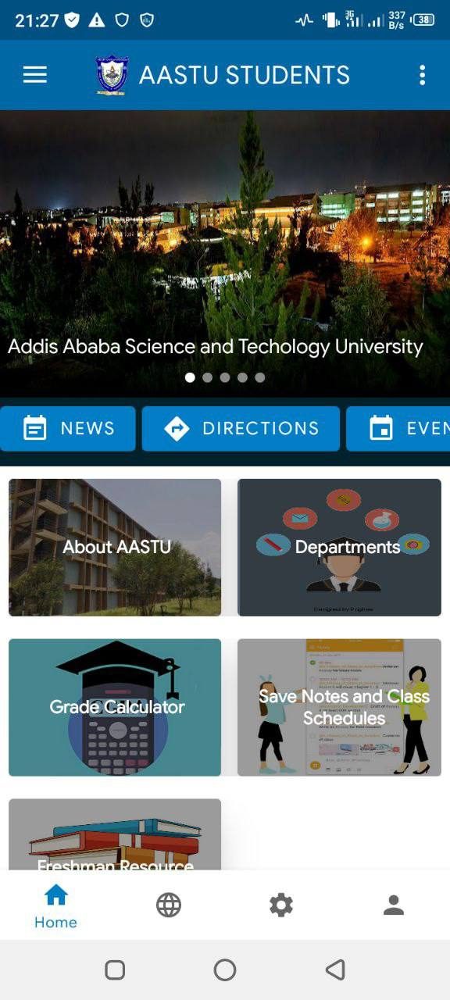
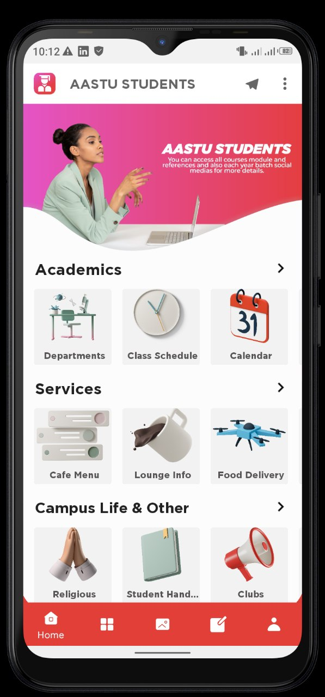
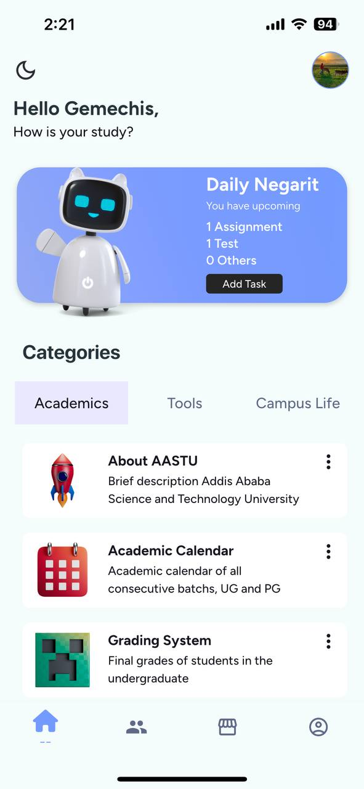
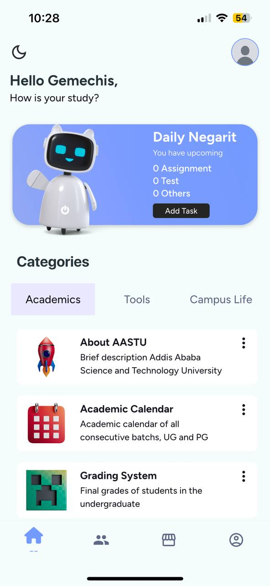

# 👨🏽‍💻 AASTU Students App v4


Welcome to the 4th iteration of the **AASTU Students App**—a productivity and social networking platform tailored for the students of **Addis Ababa Science and Technology University**. Unlike previous versions, this release is built using [FlutterFlow](https://flutterflow.io/), a Flutter-based UI framework that enhances both development efficiency and user experience.

## 🚀 Features
FlutterFlow projects are built to run on the Flutter **stable** release.

- **Productivity Tools**: Access academic resources, grade calculator, and reminders.
- **Social Networking**: Connect with peers, join groups, and participate in campus events.
- **Campus Life**: Virtual ID card, campus clubs, and gallery.
- **User-Friendly Interface**: Designed with an intuitive UI for seamless navigation.

## 📜 Previous Versions
<div align="center">
  
  
  
    
</div>

<div align="center">
  <strong>Version 1 - (2021)</strong> &nbsp;&nbsp;&nbsp;&nbsp; 
  <strong>Version 3 - (2022)</strong> &nbsp;&nbsp;&nbsp;&nbsp;
  <strong>Version 3 - (2023)</strong> &nbsp;&nbsp;&nbsp;&nbsp;
  <strong>Version 4 - (2025)</strong>
</div>

## 🛠 Installation
To run the app on your local machine, follow these steps:

### **1. Install Flutter**
- Follow the official Flutter installation guide: [Flutter Docs](https://flutter.dev/docs/get-started/install)

### **2. Clone the Repository**
```sh
  git clone https://github.com/chisa-dev/aastu-students-app-v4.git
  cd AASTU-Students-App
```

### **3. Set Up Firebase**
- Place the `google-services.json` file inside `android/app/`.
- Configure Firebase credentials in `lib/backend/firebase/firebase_config.dart`.

### **4. Run the Project**
#### **Android**
```sh
flutter run
```
#### **iOS**
```sh
cd ios && pod install && cd ..
flutter run
```
#### **Web**
```sh
flutter build web
flutter serve
```

## 🤝 Contributing
Contributions are welcome! Choose one of the following ways to contribute:

1. **Build standalone features separately in Flutter** and submit your code via a pull request.
2. **Report issues** by creating a GitHub issue.
3. **Directly fix an issue** and submit a pull request.

## 📜 License
This project is licensed under the **MIT License** - see the [LICENSE](LICENSE) file for details.

## 🙌 Acknowledgements
- [Gemechis Elias](https://github.com/chisa-dev) - Project Developer
- [Getabalew Asfaw](https://github.com/GetabalewAsfaw) - UI Designer
- [Ayenew Tarekegn](https://github.com/Ayenewtarekegn18) - Developer / Early Tester
- [Dagimawi Babi](https://github.com/dagmawibabi) - Early Tester
- [Abigail F](#) - Product / Early Tester
- [Yohannes](https://t.me/joey_yos) - Early Tester