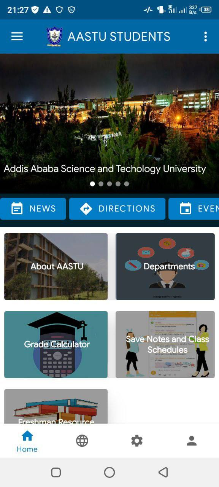
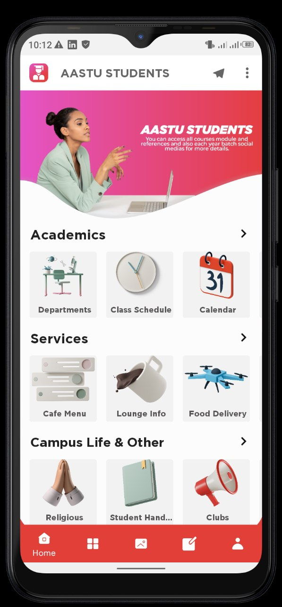
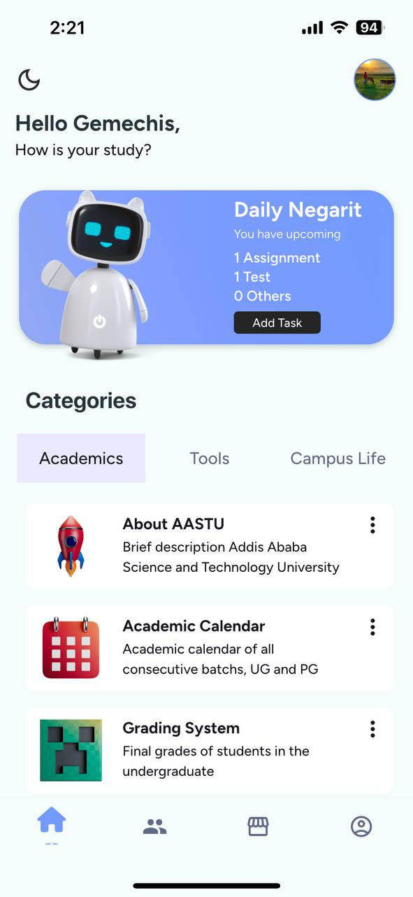
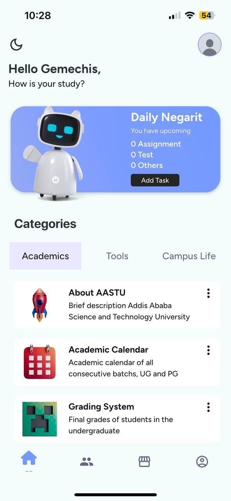

# 👨🏽‍💻 AASTU Students App v4


Welcome to the 4th iteration of the **AASTU Students App**—a productivity and social networking platform tailored for the students of **Addis Ababa Science and Technology University**. Unlike previous versions, this release is built using [FlutterFlow](https://flutterflow.io/), a Flutter-based UI framework that enhances both development efficiency and user experience.

## 🚀 Features

### Productivity & Academics
- **Class Schedule Builder** — Build your weekly timetable, set classes across multiple days, edit or remove anytime
- **Daily Negarit (Task Manager)** — Create tasks with reminders, categorize by assignment/test/other, mark as complete
- **Grade Calculator** — Calculate GPA & CGPA, save grade history across semesters
- **Grading System** — Interactive grade scale table with a built-in grade checker playground
- **Quiz Generator** — AI-powered quiz generation from course topics using Google Gemini
- **Academic Calendar** — View academic calendars for all batches (UG & PG)

### Social & Community
- **Social Feed** — Post text & media, like, comment, and share with the campus community
- **Stories** — Share temporary updates visible to all students
- **Real-time Chat** — Direct and group messaging with media sharing, read receipts, and unread badges
- **User Profiles** — Follow other students, view posts, and connect
- **Push Notifications** — Get notified when someone follows you or likes your post

### Campus Life
- **Virtual ID Card** — Digital student ID with QR code support
- **Campus Gallery** — Explore campus through photos and videos
- **Religious Communities** — Find fellowships and religious groups on campus
- **Associations & Clubs** — Discover student-led organizations
- **Student Handbook** — Official AASTU student handbook

### Marketplace
- **Campus Store** — Buy and sell items within the student community
- **Category Filtering** — Browse items by category with a mixed card layout
- **Item Management** — Upload, manage, and track your listed items

### Utilities
- **Student Portal** — Quick access to the official AASTU student portal
- **QR Code Scanner** — Scan QR codes for campus services
- **Dark/Light Mode** — Full theme support with persistence
- **Pull-to-Refresh** — Refresh feed content with a simple pull gesture

## 🏗 Why FlutterFlow?

This project has gone through four major iterations, each built with a different technology stack based on the needs of the time:

| Version | Year | Technology | Notes |
|---------|------|-----------|-------|
| **v1** | 2021 | Android Native (Java) | First release — core features, Android only |
| **v2** | 2022 | Android Native (Java) | Improved UI, more features, still Android only |
| **v3** | 2023 | Flutter (Pure) | Cross-platform rewrite — iOS + Android from one codebase |
| **v4** | 2025 | FlutterFlow (Flutter) | Current version — web, mobile, and Telegram Mini App compatible |

**Why the switch to FlutterFlow?**

After v3 proved Flutter's cross-platform capabilities, we needed to expand beyond mobile. The app needed to run as a **web app** and as a **Telegram Mini App** — platforms where rapid UI iteration and responsive layouts matter. FlutterFlow gave us:

- **Faster UI development** — Visual builder for layouts while keeping full code access for custom logic
- **Web & Telegram Mini App compatibility** — Responsive design primitives that work across all form factors out of the box
- **Same Flutter foundation** — All custom Dart code, Firebase integration, and platform channels work exactly the same as pure Flutter
- **Easier onboarding for contributors** — New developers can understand and modify the UI without deep Flutter widget tree knowledge

The result is a single codebase that ships to Android, iOS, Web, and Telegram — while still allowing full custom Dart code for features like the AI quiz generator, push notifications, and NFC/QR scanning.

## 📜 Previous Versions
<div align="center">
  
  
  
    
</div>

<div align="center">
  <strong>Version 1 - (2021)</strong> &nbsp;&nbsp;&nbsp;&nbsp; 
  <strong>Version 2 - (2022)</strong> &nbsp;&nbsp;&nbsp;&nbsp;
  <strong>Version 3 - (2023)</strong> &nbsp;&nbsp;&nbsp;&nbsp;
  <strong>Version 4 - (2025)</strong>
</div>

## 🛠 Installation
To run the app on your local machine, follow these steps:

### **1. Install Flutter**
- Follow the official Flutter installation guide: [Flutter Docs](https://flutter.dev/docs/get-started/install)

### **2. Clone the Repository**
```sh
  git clone https://github.com/chisa-dev/aastu-students-app-v4.git
  cd AASTU-Students-App
```

### **3. Set Up Firebase**
- Place the `google-services.json` file inside `android/app/`.
- Configure Firebase credentials in `lib/backend/firebase/firebase_config.dart`.

### **4. Run the Project**
#### **Android**
```sh
flutter run
```
#### **iOS**
```sh
cd ios && pod install && cd ..
flutter run
```
#### **Web**
```sh
flutter build web
flutter serve
```

## 🤝 Contributing
Contributions are welcome! Choose one of the following ways to contribute:

1. **Build standalone features separately in Flutter** and submit your code.
2. **Report issues** by creating a GitHub issue.
3. **Directly fix an issue** and submit a pull request.

## 📜 License
This project is licensed under the **MIT License** - see the [LICENSE](LICENSE) file for details.

## 🙌 Acknowledgements
- [Gemechis Elias](https://github.com/chisa-dev) - Project Developer
- [Getabalew Asfaw](https://github.com/GetabalewAsfaw) - UI Designer
- [Ayenew Tarekegn](https://github.com/Ayenewtarekegn18) - Developer / Early Tester
- [Dagimawi Babi](https://github.com/dagmawibabi) - Early Tester
- [Abigail F](#) - Product / Early Tester
- [Yohannes](https://t.me/joey_yos) - Early Tester
